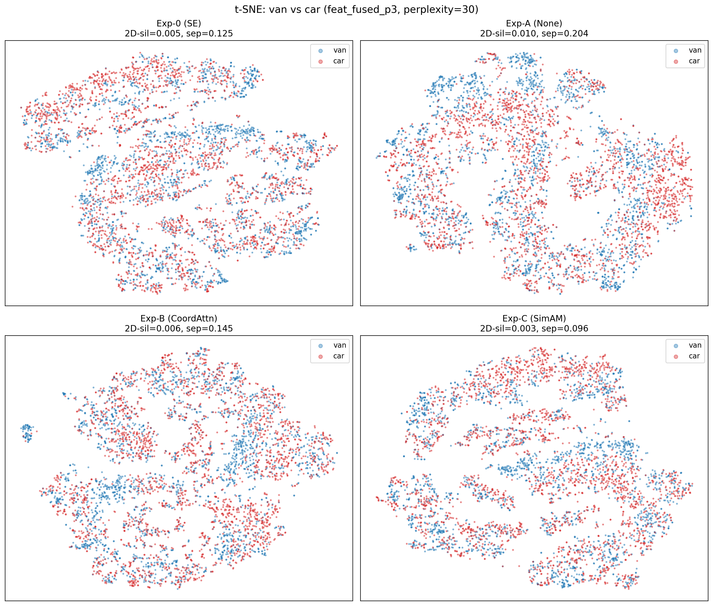
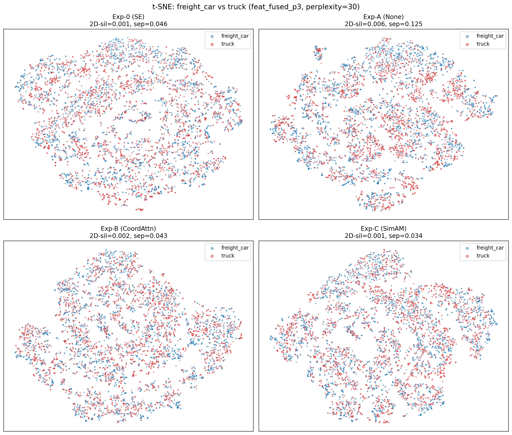

# 四模型特征诊断对比报告

- 生成时间：2026-04-05T02:51:07.041154
- 全局种子：42
- 数据集：DroneVehicle test set（8876 图，176842 实例）

## 1. 实验概览

| 模型 | P3 融合模块 | 注意力类型 | mAP50 | mAP50-95 | van mAP50 | van Recall | fc mAP50 | truck mAP50 |
| --- | --- | --- | --- | --- | --- | --- | --- | --- |
| M5 (三点参考) | FeatureAttentionConcat ×3 | SE | 0.7617 | 0.6154 | 0.6170 | 0.5430 | 0.6001 | 0.7367 |
| Exp-0 | FeatureAttentionConcat | SE | 0.7683 | 0.6217 | 0.6290 | 0.5502 | 0.6166 | 0.7399 |
| Exp-A | InceptionConcat | 无 | 0.7554 | 0.6124 | 0.5934 | 0.5157 | 0.6100 | 0.7220 |
| Exp-B | InceptionCoordAttnConcat | CoordAttn | 0.7627 | 0.6188 | 0.6194 | 0.5490 | 0.6015 | 0.7357 |
| Exp-C | InceptionSimAMConcat | SimAM | 0.7682 | 0.6238 | 0.6339 | 0.5570 | 0.6155 | 0.7369 |

## 2. 线性探针（主表：feat_fused_p3）

| 模型 | van:car acc±std | fc:truck acc±std | car:bus acc±std |
| --- | --- | --- | --- |
| M5 (三点参考) | 0.7891±0.0078 | 0.7095±0.0112 | 0.9532±0.0045 |
| Exp-0 | 0.7999±0.0146 | 0.6910±0.0199 | 0.9625±0.0061 |
| Exp-A | 0.8244±0.0079 | 0.7401±0.0045 | 0.9671±0.0029 |
| Exp-B | 0.7826±0.0122 | 0.6884±0.0095 | 0.9573±0.0032 |
| Exp-C | 0.8011±0.0112 | 0.6987±0.0088 | 0.9553±0.0019 |

### 2.1 增量表（相对 Exp-A）

| 指标 | Exp-0 − Exp-A | Exp-B − Exp-A | Exp-C − Exp-A |
| --- | --- | --- | --- |
| van:car | -0.0244 | -0.0418 | -0.0232 |
| freight_car:truck | -0.0490 | -0.0517 | -0.0413 |
| car:bus | -0.0047 | -0.0098 | -0.0118 |

## 3. Fisher Ratio（主表：feat_fused_p3, top-10 mean）

| 模型 | van:car | fc:truck | car:bus |
| --- | --- | --- | --- |
| M5 (三点参考) | 0.1084 | 0.0675 | 0.6652 |
| Exp-0 | 0.1400 | 0.0344 | 0.8044 |
| Exp-A | 0.1455 | 0.0896 | 0.6765 |
| Exp-B | 0.1151 | 0.0332 | 0.8264 |
| Exp-C | 0.1091 | 0.0351 | 0.8047 |

### 3.1 增量表（相对 Exp-A）

| 指标 | Exp-0 − Exp-A | Exp-B − Exp-A | Exp-C − Exp-A |
| --- | --- | --- | --- |
| van:car | -0.0055 | -0.0304 | -0.0365 |
| freight_car:truck | -0.0552 | -0.0563 | -0.0545 |
| car:bus | +0.1279 | +0.1499 | +0.1282 |

## 4. Silhouette Score（feat_fused_p3）

| 模型 | van:car | fc:truck | car:bus |
| --- | --- | --- | --- |
| Exp-0 | 0.0125 | 0.0036 | 0.0600 |
| Exp-A | 0.0151 | 0.0097 | 0.0577 |
| Exp-B | 0.0117 | 0.0034 | 0.0619 |
| Exp-C | 0.0135 | 0.0027 | 0.0638 |

### 4.1 增量表（相对 Exp-A）

| 指标 | Exp-0 − Exp-A | Exp-B − Exp-A | Exp-C − Exp-A |
| --- | --- | --- | --- |
| van:car | -0.0026 | -0.0034 | -0.0017 |
| freight_car:truck | -0.0061 | -0.0063 | -0.0070 |
| car:bus | +0.0023 | +0.0042 | +0.0061 |

## 5. SE 权重相关性

### 5.1 主表（feat_fused_p3）

| 模型 | class_pair | attn_source | pearson_r | p_value |
| --- | --- | --- | --- | --- |
| M5 (三点参考) | van:car | rgb | -0.0325 | 0.799 |
| M5 (三点参考) | van:car | ir | -0.3019 | 0.01533 |
| M5 (三点参考) | freight_car:truck | rgb | 0.0799 | 0.5302 |
| M5 (三点参考) | freight_car:truck | ir | -0.0626 | 0.6234 |
| M5 (三点参考) | car:bus | rgb | -0.0018 | 0.9886 |
| M5 (三点参考) | car:bus | ir | -0.1972 | 0.1183 |
| Exp-0 | van:car | rgb | 0.2202 | 0.08033 |
| Exp-0 | van:car | ir | -0.1699 | 0.1797 |
| Exp-0 | freight_car:truck | rgb | -0.1145 | 0.3678 |
| Exp-0 | freight_car:truck | ir | -0.0002 | 0.9989 |
| Exp-0 | car:bus | rgb | 0.1279 | 0.3139 |
| Exp-0 | car:bus | ir | -0.1153 | 0.3643 |

### 5.2 Exp-B/C 近似注意力分析

| 模型 | class_pair | attn_source | pearson_r | p_value | finite_ratio | out_of_unit_ratio | 说明 |
| --- | --- | --- | --- | --- | --- | --- | --- |
| Exp-B | van:car | rgb | -0.0625 | 0.6239 | 1.0000 | 0.0104 | †近似值：output/(input+ε) |
| Exp-B | van:car | ir | -0.1897 | 0.1332 | 1.0000 | 0.0099 | †近似值：output/(input+ε) |
| Exp-B | freight_car:truck | rgb | 0.1809 | 0.1525 | 1.0000 | 0.0116 | †近似值：output/(input+ε) |
| Exp-B | freight_car:truck | ir | 0.1113 | 0.3813 | 1.0000 | 0.0081 | †近似值：output/(input+ε) |
| Exp-B | car:bus | rgb | -0.0568 | 0.6556 | 1.0000 | 0.0123 | †近似值：output/(input+ε) |
| Exp-B | car:bus | ir | -0.2205 | 0.08001 | 1.0000 | 0.0102 | †近似值：output/(input+ε) |
| Exp-C | van:car | rgb | -0.0260 | 0.8381 | 1.0000 | 0.1670 | †近似值：output/(input+ε) |
| Exp-C | van:car | ir | -0.2546 | 0.04236 | 1.0000 | 0.1336 | †近似值：output/(input+ε) |
| Exp-C | freight_car:truck | rgb | 0.0521 | 0.6828 | 1.0000 | 0.1406 | †近似值：output/(input+ε) |
| Exp-C | freight_car:truck | ir | 0.0367 | 0.7733 | 1.0000 | 0.1051 | †近似值：output/(input+ε) |
| Exp-C | car:bus | rgb | 0.0243 | 0.8487 | 1.0000 | 0.1688 | †近似值：output/(input+ε) |
| Exp-C | car:bus | ir | -0.0935 | 0.4625 | 1.0000 | 0.1332 | †近似值：output/(input+ε) |

## 6. t-SNE 可视化

稳定性检验：Exp-0 van:car: 通过；Exp-0 freight_car:truck: 通过；Exp-A van:car: 通过；Exp-A freight_car:truck: 通过；Exp-B van:car: 通过；Exp-B freight_car:truck: 通过；Exp-C van:car: 通过；Exp-C freight_car:truck: 通过

## 7. 附录：全层分析数据

### 7.1 线性探针全层数据

| model | feature_key | class_pair | acc_mean | acc_std | n_samples |
| --- | --- | --- | --- | --- | --- |
| M5 (三点参考) | feat_fused_p3 | van:car | 0.7891 | 0.0078 | 156002 |
| M5 (三点参考) | feat_fused_p3 | freight_car:truck | 0.7095 | 0.0112 | 16139 |
| M5 (三点参考) | feat_fused_p3 | car:bus | 0.9532 | 0.0045 | 156057 |
| M5 (三点参考) | feat_ir_p3 | van:car | 0.7890 | 0.0101 | 156002 |
| M5 (三点参考) | feat_ir_p3 | freight_car:truck | 0.7110 | 0.0106 | 16139 |
| M5 (三点参考) | feat_ir_p3 | car:bus | 0.9525 | 0.0039 | 156057 |
| M5 (三点参考) | feat_pre_attn_ir | van:car | 0.7856 | 0.0102 | 156002 |
| M5 (三点参考) | feat_pre_attn_ir | freight_car:truck | 0.7040 | 0.0130 | 16139 |
| M5 (三点参考) | feat_pre_attn_ir | car:bus | 0.9484 | 0.0036 | 156057 |
| M5 (三点参考) | feat_pre_attn_rgb | van:car | 0.7309 | 0.0090 | 156002 |
| M5 (三点参考) | feat_pre_attn_rgb | freight_car:truck | 0.6681 | 0.0060 | 16139 |
| M5 (三点参考) | feat_pre_attn_rgb | car:bus | 0.8723 | 0.0041 | 156057 |
| M5 (三点参考) | feat_rgb_p3 | van:car | 0.7464 | 0.0077 | 156002 |
| M5 (三点参考) | feat_rgb_p3 | freight_car:truck | 0.6701 | 0.0064 | 16139 |
| M5 (三点参考) | feat_rgb_p3 | car:bus | 0.8794 | 0.0042 | 156057 |
| Exp-0 | feat_fused_p3 | van:car | 0.7999 | 0.0146 | 156002 |
| Exp-0 | feat_fused_p3 | freight_car:truck | 0.6910 | 0.0199 | 16139 |
| Exp-0 | feat_fused_p3 | car:bus | 0.9625 | 0.0061 | 156057 |
| Exp-0 | feat_ir_p3 | van:car | 0.7888 | 0.0072 | 156002 |
| Exp-0 | feat_ir_p3 | freight_car:truck | 0.7040 | 0.0138 | 16139 |
| Exp-0 | feat_ir_p3 | car:bus | 0.9506 | 0.0057 | 156057 |
| Exp-0 | feat_pre_attn_ir | van:car | 0.7843 | 0.0124 | 156002 |
| Exp-0 | feat_pre_attn_ir | freight_car:truck | 0.7084 | 0.0101 | 16139 |
| Exp-0 | feat_pre_attn_ir | car:bus | 0.9551 | 0.0059 | 156057 |
| Exp-0 | feat_pre_attn_rgb | van:car | 0.7458 | 0.0114 | 156002 |
| Exp-0 | feat_pre_attn_rgb | freight_car:truck | 0.6686 | 0.0040 | 16139 |
| Exp-0 | feat_pre_attn_rgb | car:bus | 0.9043 | 0.0066 | 156057 |
| Exp-0 | feat_rgb_p3 | van:car | 0.7584 | 0.0040 | 156002 |
| Exp-0 | feat_rgb_p3 | freight_car:truck | 0.6753 | 0.0059 | 16139 |
| Exp-0 | feat_rgb_p3 | car:bus | 0.9029 | 0.0055 | 156057 |
| Exp-A | feat_fused_p3 | van:car | 0.8244 | 0.0079 | 156002 |
| Exp-A | feat_fused_p3 | freight_car:truck | 0.7401 | 0.0045 | 16139 |
| Exp-A | feat_fused_p3 | car:bus | 0.9671 | 0.0029 | 156057 |
| Exp-A | feat_ir_p3 | van:car | 0.7786 | 0.0075 | 156002 |
| Exp-A | feat_ir_p3 | freight_car:truck | 0.6892 | 0.0087 | 16139 |
| Exp-A | feat_ir_p3 | car:bus | 0.9452 | 0.0042 | 156057 |
| Exp-A | feat_pre_attn_ir | van:car | 0.7831 | 0.0112 | 156002 |
| Exp-A | feat_pre_attn_ir | freight_car:truck | 0.6898 | 0.0141 | 16139 |
| Exp-A | feat_pre_attn_ir | car:bus | 0.9535 | 0.0052 | 156057 |
| Exp-A | feat_pre_attn_rgb | van:car | 0.7714 | 0.0041 | 156002 |
| Exp-A | feat_pre_attn_rgb | freight_car:truck | 0.6895 | 0.0064 | 16139 |
| Exp-A | feat_pre_attn_rgb | car:bus | 0.8980 | 0.0055 | 156057 |
| Exp-A | feat_rgb_p3 | van:car | 0.7529 | 0.0099 | 156002 |
| Exp-A | feat_rgb_p3 | freight_car:truck | 0.6868 | 0.0116 | 16139 |
| Exp-A | feat_rgb_p3 | car:bus | 0.8831 | 0.0037 | 156057 |
| Exp-B | feat_fused_p3 | van:car | 0.7826 | 0.0122 | 156002 |
| Exp-B | feat_fused_p3 | freight_car:truck | 0.6884 | 0.0095 | 16139 |
| Exp-B | feat_fused_p3 | car:bus | 0.9573 | 0.0032 | 156057 |
| Exp-B | feat_ir_p3 | van:car | 0.7921 | 0.0069 | 156002 |
| Exp-B | feat_ir_p3 | freight_car:truck | 0.7025 | 0.0118 | 16139 |
| Exp-B | feat_ir_p3 | car:bus | 0.9465 | 0.0055 | 156057 |
| Exp-B | feat_post_attn_ir | van:car | 0.7772 | 0.0105 | 156002 |
| Exp-B | feat_post_attn_ir | freight_car:truck | 0.6968 | 0.0107 | 16139 |
| Exp-B | feat_post_attn_ir | car:bus | 0.9494 | 0.0048 | 156057 |
| Exp-B | feat_post_attn_rgb | van:car | 0.7628 | 0.0085 | 156002 |
| Exp-B | feat_post_attn_rgb | freight_car:truck | 0.6742 | 0.0038 | 16139 |
| Exp-B | feat_post_attn_rgb | car:bus | 0.8989 | 0.0044 | 156057 |
| Exp-B | feat_pre_attn_ir | van:car | 0.7739 | 0.0050 | 156002 |
| Exp-B | feat_pre_attn_ir | freight_car:truck | 0.6927 | 0.0099 | 16139 |
| Exp-B | feat_pre_attn_ir | car:bus | 0.9506 | 0.0053 | 156057 |
| Exp-B | feat_pre_attn_rgb | van:car | 0.7566 | 0.0030 | 156002 |
| Exp-B | feat_pre_attn_rgb | freight_car:truck | 0.6724 | 0.0042 | 16139 |
| Exp-B | feat_pre_attn_rgb | car:bus | 0.8950 | 0.0034 | 156057 |
| Exp-B | feat_rgb_p3 | van:car | 0.7614 | 0.0062 | 156002 |
| Exp-B | feat_rgb_p3 | freight_car:truck | 0.6716 | 0.0049 | 16139 |
| Exp-B | feat_rgb_p3 | car:bus | 0.9063 | 0.0063 | 156057 |
| Exp-C | feat_fused_p3 | van:car | 0.8011 | 0.0112 | 156002 |
| Exp-C | feat_fused_p3 | freight_car:truck | 0.6987 | 0.0088 | 16139 |
| Exp-C | feat_fused_p3 | car:bus | 0.9553 | 0.0019 | 156057 |
| Exp-C | feat_ir_p3 | van:car | 0.7883 | 0.0058 | 156002 |
| Exp-C | feat_ir_p3 | freight_car:truck | 0.6963 | 0.0109 | 16139 |
| Exp-C | feat_ir_p3 | car:bus | 0.9510 | 0.0035 | 156057 |
| Exp-C | feat_post_attn_ir | van:car | 0.7682 | 0.0112 | 156002 |
| Exp-C | feat_post_attn_ir | freight_car:truck | 0.7001 | 0.0157 | 16139 |
| Exp-C | feat_post_attn_ir | car:bus | 0.9474 | 0.0022 | 156057 |
| Exp-C | feat_post_attn_rgb | van:car | 0.7298 | 0.0078 | 156002 |
| Exp-C | feat_post_attn_rgb | freight_car:truck | 0.6675 | 0.0085 | 16139 |
| Exp-C | feat_post_attn_rgb | car:bus | 0.8931 | 0.0017 | 156057 |
| Exp-C | feat_pre_attn_ir | van:car | 0.7749 | 0.0135 | 156002 |
| Exp-C | feat_pre_attn_ir | freight_car:truck | 0.7006 | 0.0137 | 16139 |
| Exp-C | feat_pre_attn_ir | car:bus | 0.9498 | 0.0030 | 156057 |
| Exp-C | feat_pre_attn_rgb | van:car | 0.7377 | 0.0037 | 156002 |
| Exp-C | feat_pre_attn_rgb | freight_car:truck | 0.6706 | 0.0083 | 16139 |
| Exp-C | feat_pre_attn_rgb | car:bus | 0.8981 | 0.0026 | 156057 |
| Exp-C | feat_rgb_p3 | van:car | 0.7570 | 0.0093 | 156002 |
| Exp-C | feat_rgb_p3 | freight_car:truck | 0.6771 | 0.0059 | 16139 |
| Exp-C | feat_rgb_p3 | car:bus | 0.8926 | 0.0055 | 156057 |

### 7.2 Fisher Ratio 全层数据

| model | feature_key | class_pair | top10_mean | n_samples |
| --- | --- | --- | --- | --- |
| M5 (三点参考) | feat_fused_p3 | van:car | 0.1084 | 9292 |
| M5 (三点参考) | feat_fused_p3 | freight_car:truck | 0.0675 | 11972 |
| M5 (三点参考) | feat_fused_p3 | car:bus | 0.6652 | 9402 |
| M5 (三点参考) | feat_ir_p3 | van:car | 0.1596 | 9292 |
| M5 (三点参考) | feat_ir_p3 | freight_car:truck | 0.0805 | 11972 |
| M5 (三点参考) | feat_ir_p3 | car:bus | 0.6121 | 9402 |
| M5 (三点参考) | feat_pre_attn_ir | van:car | 0.1280 | 9292 |
| M5 (三点参考) | feat_pre_attn_ir | freight_car:truck | 0.0858 | 11972 |
| M5 (三点参考) | feat_pre_attn_ir | car:bus | 0.6128 | 9402 |
| M5 (三点参考) | feat_pre_attn_rgb | van:car | 0.0399 | 9292 |
| M5 (三点参考) | feat_pre_attn_rgb | freight_car:truck | 0.0335 | 11972 |
| M5 (三点参考) | feat_pre_attn_rgb | car:bus | 0.2401 | 9402 |
| M5 (三点参考) | feat_rgb_p3 | van:car | 0.0704 | 9292 |
| M5 (三点参考) | feat_rgb_p3 | freight_car:truck | 0.0343 | 11972 |
| M5 (三点参考) | feat_rgb_p3 | car:bus | 0.2840 | 9402 |
| Exp-0 | feat_fused_p3 | van:car | 0.1400 | 9292 |
| Exp-0 | feat_fused_p3 | freight_car:truck | 0.0344 | 11972 |
| Exp-0 | feat_fused_p3 | car:bus | 0.8044 | 9402 |
| Exp-0 | feat_ir_p3 | van:car | 0.1753 | 9292 |
| Exp-0 | feat_ir_p3 | freight_car:truck | 0.0859 | 11972 |
| Exp-0 | feat_ir_p3 | car:bus | 0.6816 | 9402 |
| Exp-0 | feat_pre_attn_ir | van:car | 0.1090 | 9292 |
| Exp-0 | feat_pre_attn_ir | freight_car:truck | 0.0842 | 11972 |
| Exp-0 | feat_pre_attn_ir | car:bus | 0.5884 | 9402 |
| Exp-0 | feat_pre_attn_rgb | van:car | 0.0673 | 9292 |
| Exp-0 | feat_pre_attn_rgb | freight_car:truck | 0.0372 | 11972 |
| Exp-0 | feat_pre_attn_rgb | car:bus | 0.2872 | 9402 |
| Exp-0 | feat_rgb_p3 | van:car | 0.0938 | 9292 |
| Exp-0 | feat_rgb_p3 | freight_car:truck | 0.0442 | 11972 |
| Exp-0 | feat_rgb_p3 | car:bus | 0.3610 | 9402 |
| Exp-A | feat_fused_p3 | van:car | 0.1455 | 9292 |
| Exp-A | feat_fused_p3 | freight_car:truck | 0.0896 | 11972 |
| Exp-A | feat_fused_p3 | car:bus | 0.6765 | 9402 |
| Exp-A | feat_ir_p3 | van:car | 0.1389 | 9292 |
| Exp-A | feat_ir_p3 | freight_car:truck | 0.1067 | 11972 |
| Exp-A | feat_ir_p3 | car:bus | 0.5291 | 9402 |
| Exp-A | feat_pre_attn_ir | van:car | 0.1416 | 9292 |
| Exp-A | feat_pre_attn_ir | freight_car:truck | 0.1110 | 11972 |
| Exp-A | feat_pre_attn_ir | car:bus | 0.7419 | 9402 |
| Exp-A | feat_pre_attn_rgb | van:car | 0.0861 | 9292 |
| Exp-A | feat_pre_attn_rgb | freight_car:truck | 0.0438 | 11972 |
| Exp-A | feat_pre_attn_rgb | car:bus | 0.2074 | 9402 |
| Exp-A | feat_rgb_p3 | van:car | 0.0761 | 9292 |
| Exp-A | feat_rgb_p3 | freight_car:truck | 0.0419 | 11972 |
| Exp-A | feat_rgb_p3 | car:bus | 0.2026 | 9402 |
| Exp-B | feat_fused_p3 | van:car | 0.1151 | 9292 |
| Exp-B | feat_fused_p3 | freight_car:truck | 0.0332 | 11972 |
| Exp-B | feat_fused_p3 | car:bus | 0.8264 | 9402 |
| Exp-B | feat_ir_p3 | van:car | 0.1742 | 9292 |
| Exp-B | feat_ir_p3 | freight_car:truck | 0.0831 | 11972 |
| Exp-B | feat_ir_p3 | car:bus | 0.6251 | 9402 |
| Exp-B | feat_post_attn_ir | van:car | 0.1103 | 9292 |
| Exp-B | feat_post_attn_ir | freight_car:truck | 0.0566 | 11972 |
| Exp-B | feat_post_attn_ir | car:bus | 0.4634 | 9402 |
| Exp-B | feat_post_attn_rgb | van:car | 0.0423 | 9292 |
| Exp-B | feat_post_attn_rgb | freight_car:truck | 0.0359 | 11972 |
| Exp-B | feat_post_attn_rgb | car:bus | 0.1961 | 9402 |
| Exp-B | feat_pre_attn_ir | van:car | 0.1247 | 9292 |
| Exp-B | feat_pre_attn_ir | freight_car:truck | 0.0700 | 11972 |
| Exp-B | feat_pre_attn_ir | car:bus | 0.5558 | 9402 |
| Exp-B | feat_pre_attn_rgb | van:car | 0.0485 | 9292 |
| Exp-B | feat_pre_attn_rgb | freight_car:truck | 0.0356 | 11972 |
| Exp-B | feat_pre_attn_rgb | car:bus | 0.2137 | 9402 |
| Exp-B | feat_rgb_p3 | van:car | 0.0868 | 9292 |
| Exp-B | feat_rgb_p3 | freight_car:truck | 0.0410 | 11972 |
| Exp-B | feat_rgb_p3 | car:bus | 0.3978 | 9402 |
| Exp-C | feat_fused_p3 | van:car | 0.1091 | 9292 |
| Exp-C | feat_fused_p3 | freight_car:truck | 0.0351 | 11972 |
| Exp-C | feat_fused_p3 | car:bus | 0.8047 | 9402 |
| Exp-C | feat_ir_p3 | van:car | 0.1700 | 9292 |
| Exp-C | feat_ir_p3 | freight_car:truck | 0.0842 | 11972 |
| Exp-C | feat_ir_p3 | car:bus | 0.6787 | 9402 |
| Exp-C | feat_post_attn_ir | van:car | 0.0933 | 9292 |
| Exp-C | feat_post_attn_ir | freight_car:truck | 0.0681 | 11972 |
| Exp-C | feat_post_attn_ir | car:bus | 0.5249 | 9402 |
| Exp-C | feat_post_attn_rgb | van:car | 0.0574 | 9292 |
| Exp-C | feat_post_attn_rgb | freight_car:truck | 0.0318 | 11972 |
| Exp-C | feat_post_attn_rgb | car:bus | 0.2494 | 9402 |
| Exp-C | feat_pre_attn_ir | van:car | 0.0973 | 9292 |
| Exp-C | feat_pre_attn_ir | freight_car:truck | 0.0776 | 11972 |
| Exp-C | feat_pre_attn_ir | car:bus | 0.5259 | 9402 |
| Exp-C | feat_pre_attn_rgb | van:car | 0.0549 | 9292 |
| Exp-C | feat_pre_attn_rgb | freight_car:truck | 0.0340 | 11972 |
| Exp-C | feat_pre_attn_rgb | car:bus | 0.2357 | 9402 |
| Exp-C | feat_rgb_p3 | van:car | 0.0932 | 9292 |
| Exp-C | feat_rgb_p3 | freight_car:truck | 0.0431 | 11972 |
| Exp-C | feat_rgb_p3 | car:bus | 0.3736 | 9402 |

### 7.3 SE / 注意力权重全行数据

| model | feature_key | class_pair | attn_source | pearson_r | p_value | n_objects | n_images_attn |
| --- | --- | --- | --- | --- | --- | --- | --- |
| M5 (三点参考) | feat_pre_attn_rgb | van:car | rgb | -0.1789 | 0.157341 | 9292 | 1621 |
| M5 (三点参考) | feat_pre_attn_rgb | freight_car:truck | rgb | -0.0316 | 0.804494 | 11972 | 1888 |
| M5 (三点参考) | feat_pre_attn_rgb | car:bus | rgb | -0.1135 | 0.371675 | 9402 | 2952 |
| M5 (三点参考) | feat_pre_attn_ir | van:car | ir | -0.0090 | 0.943736 | 9292 | 1621 |
| M5 (三点参考) | feat_pre_attn_ir | freight_car:truck | ir | -0.0747 | 0.557405 | 11972 | 1888 |
| M5 (三点参考) | feat_pre_attn_ir | car:bus | ir | 0.0215 | 0.866377 | 9402 | 2952 |
| M5 (三点参考) | feat_fused_p3 | van:car | rgb | -0.0325 | 0.798985 | 9292 | 1621 |
| M5 (三点参考) | feat_fused_p3 | van:car | ir | -0.3019 | 0.0153319 | 9292 | 1621 |
| M5 (三点参考) | feat_fused_p3 | freight_car:truck | rgb | 0.0799 | 0.530174 | 11972 | 1888 |
| M5 (三点参考) | feat_fused_p3 | freight_car:truck | ir | -0.0626 | 0.623378 | 11972 | 1888 |
| M5 (三点参考) | feat_fused_p3 | car:bus | rgb | -0.0018 | 0.988606 | 9402 | 2952 |
| M5 (三点参考) | feat_fused_p3 | car:bus | ir | -0.1972 | 0.118264 | 9402 | 2952 |
| Exp-0 | feat_pre_attn_rgb | van:car | rgb | -0.2453 | 0.0507048 | 9292 | 1621 |
| Exp-0 | feat_pre_attn_rgb | freight_car:truck | rgb | -0.0644 | 0.613102 | 11972 | 1888 |
| Exp-0 | feat_pre_attn_rgb | car:bus | rgb | -0.2030 | 0.107741 | 9402 | 2952 |
| Exp-0 | feat_pre_attn_ir | van:car | ir | -0.1102 | 0.386059 | 9292 | 1621 |
| Exp-0 | feat_pre_attn_ir | freight_car:truck | ir | -0.0339 | 0.790309 | 11972 | 1888 |
| Exp-0 | feat_pre_attn_ir | car:bus | ir | -0.0968 | 0.446549 | 9402 | 2952 |
| Exp-0 | feat_fused_p3 | van:car | rgb | 0.2202 | 0.0803317 | 9292 | 1621 |
| Exp-0 | feat_fused_p3 | van:car | ir | -0.1699 | 0.179655 | 9292 | 1621 |
| Exp-0 | feat_fused_p3 | freight_car:truck | rgb | -0.1145 | 0.367829 | 11972 | 1888 |
| Exp-0 | feat_fused_p3 | freight_car:truck | ir | -0.0002 | 0.998871 | 11972 | 1888 |
| Exp-0 | feat_fused_p3 | car:bus | rgb | 0.1279 | 0.313926 | 9402 | 2952 |
| Exp-0 | feat_fused_p3 | car:bus | ir | -0.1153 | 0.364254 | 9402 | 2952 |
| Exp-B† | feat_fused_p3 | van:car | rgb | -0.0625 | 0.623909 | 9292 | 1621 |
| Exp-B† | feat_fused_p3 | van:car | ir | -0.1897 | 0.133179 | 9292 | 1621 |
| Exp-B† | feat_fused_p3 | freight_car:truck | rgb | 0.1809 | 0.152506 | 11972 | 1888 |
| Exp-B† | feat_fused_p3 | freight_car:truck | ir | 0.1113 | 0.381289 | 11972 | 1888 |
| Exp-B† | feat_fused_p3 | car:bus | rgb | -0.0568 | 0.655553 | 9402 | 2952 |
| Exp-B† | feat_fused_p3 | car:bus | ir | -0.2205 | 0.0800073 | 9402 | 2952 |
| Exp-C† | feat_fused_p3 | van:car | rgb | -0.0260 | 0.83814 | 9292 | 1621 |
| Exp-C† | feat_fused_p3 | van:car | ir | -0.2546 | 0.0423599 | 9292 | 1621 |
| Exp-C† | feat_fused_p3 | freight_car:truck | rgb | 0.0521 | 0.682769 | 11972 | 1888 |
| Exp-C† | feat_fused_p3 | freight_car:truck | ir | 0.0367 | 0.773289 | 11972 | 1888 |
| Exp-C† | feat_fused_p3 | car:bus | rgb | 0.0243 | 0.848734 | 9402 | 2952 |
| Exp-C† | feat_fused_p3 | car:bus | ir | -0.0935 | 0.462475 | 9402 | 2952 |

### 7.4 Silhouette 全层数据

| model | feature_key | class_pair | silhouette | n_samples |
| --- | --- | --- | --- | --- |
| Exp-0 | feat_fused_p3 | van:car | 0.0125 | 5000 |
| Exp-0 | feat_fused_p3 | freight_car:truck | 0.0036 | 5000 |
| Exp-0 | feat_fused_p3 | car:bus | 0.0600 | 5000 |
| Exp-A | feat_fused_p3 | van:car | 0.0151 | 5000 |
| Exp-A | feat_fused_p3 | freight_car:truck | 0.0097 | 5000 |
| Exp-A | feat_fused_p3 | car:bus | 0.0577 | 5000 |
| Exp-B | feat_fused_p3 | van:car | 0.0117 | 5000 |
| Exp-B | feat_fused_p3 | freight_car:truck | 0.0034 | 5000 |
| Exp-B | feat_fused_p3 | car:bus | 0.0619 | 5000 |
| Exp-C | feat_fused_p3 | van:car | 0.0135 | 5000 |
| Exp-C | feat_fused_p3 | freight_car:truck | 0.0027 | 5000 |
| Exp-C | feat_fused_p3 | car:bus | 0.0638 | 5000 |

## 8. 层索引验证记录

| 模型 | Layer 7 | Layer 17 | Layer 23 | Layer 24 | Layer 23 children |
| --- | --- | --- | --- | --- | --- |
| Exp-0 | C2f | C2f | FeatureAttentionConcat | C2f | inc_rgb, inc_ir, se_rgb, se_ir |
| Exp-A | C2f | C2f | InceptionConcat | C2f | inc_rgb, inc_ir |
| Exp-B | C2f | C2f | InceptionCoordAttnConcat | C2f | inc_rgb, inc_ir, ca_rgb, ca_ir |
| Exp-C | C2f | C2f | InceptionSimAMConcat | C2f | inc_rgb, inc_ir, sa_rgb, sa_ir |

